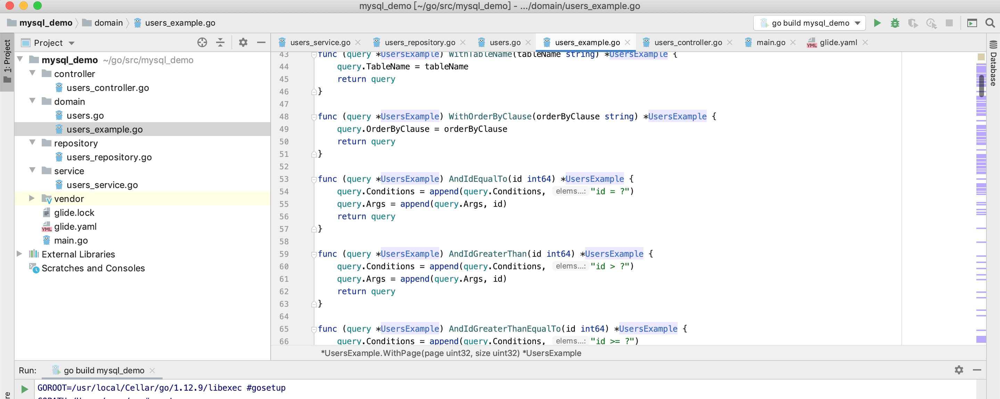

# go-mybatis-generator

## Introduction

该项目是 mybatis-generator go版本的移植,同时加入协程与分库分表支持

## 预览




### Go Mybatis Generator

前往 [Go Mybatis Generator](https://wu191287278.github.io/go-mybatis-generator/index.html) 生成代码


#### Getting Started

```sql
CREATE TABLE `users` (
  `id` int(11) NOT NULL AUTO_INCREMENT,
  `email` varchar(255) DEFAULT NULL,
  `user_id` bigint(20) DEFAULT NULL,
  `created_at` datetime DEFAULT NULL,
  PRIMARY KEY (`id`)
) ENGINE=InnoDB AUTO_INCREMENT=994 DEFAULT CHARSET=utf8mb4;
```


### 从数据库中生成元数据信息
```
git clone https://github.com/wu191287278/go-mybatis-generator
cd go-mybatis-generator
go get github.com/go-sql-driver/mysql
go build
./go-mybatis-generator -host localhost -username root -password root -dbname 500px #默认生成元数据到template/example.json文件中
```

#### SelectByExample
```go
package main

import (
	"database/sql"
	"fmt"
	. "mysql_demo/domain"
)

func main() {
	db, _ := sql.Open("mysql", "root:root@(localhost:3306)/users")
	defer db.Close()
	users, e := NewUsersExample().WithDB(db).WithPage(1, 20).AndUserIdEqualTo(1).AndEmailLike("%@qq.com").SelectByExample()
	if e != nil {
		panic(e)
	}
	fmt.Println(users)
}

```

#### ChannelByExample

```go
package main

import (
	"database/sql"
	"fmt"
	. "mysql_demo/domain"
)

func main() {
	db, _ := sql.Open("mysql", "root:root@(localhost:3306)/users")
	defer db.Close()
	ch := make(chan *Users, 1)
	go func(ch chan *Users) {
		for u := range ch {
			fmt.Println(u)
		}
	}(ch)
	e := NewUsersExample().WithDB(db).WithPage(1, 20).AndUserIdEqualTo(1).SelectChannel(ch)
	if e != nil {
		panic(e)
	}
}

```
